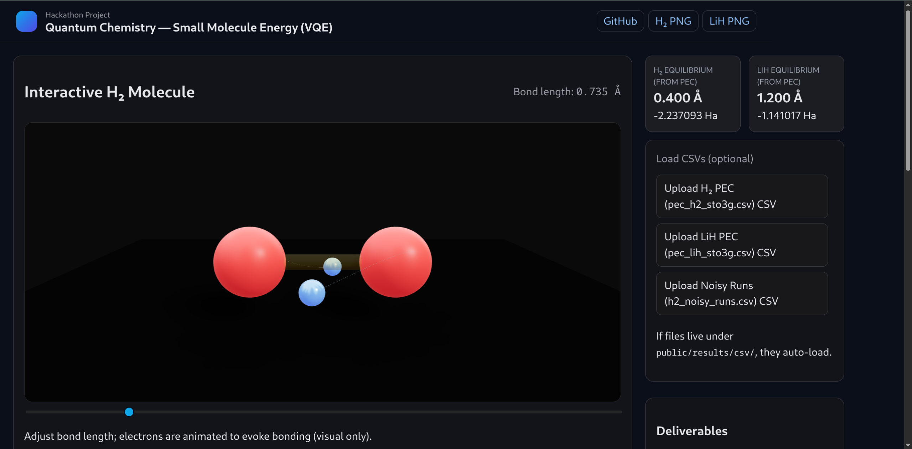
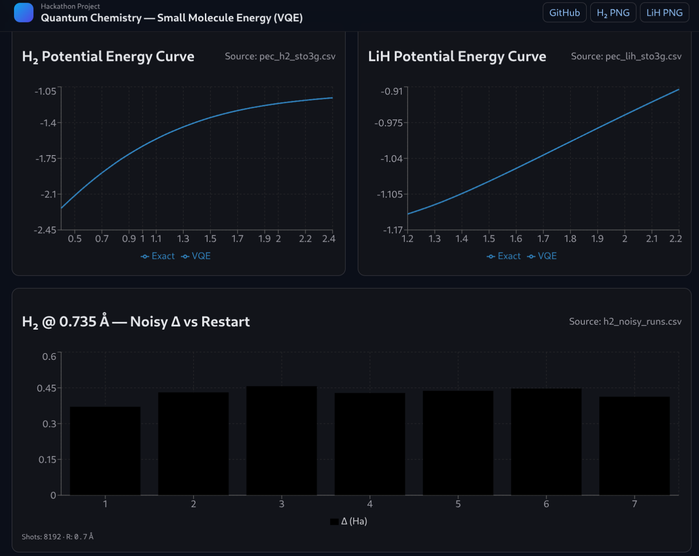
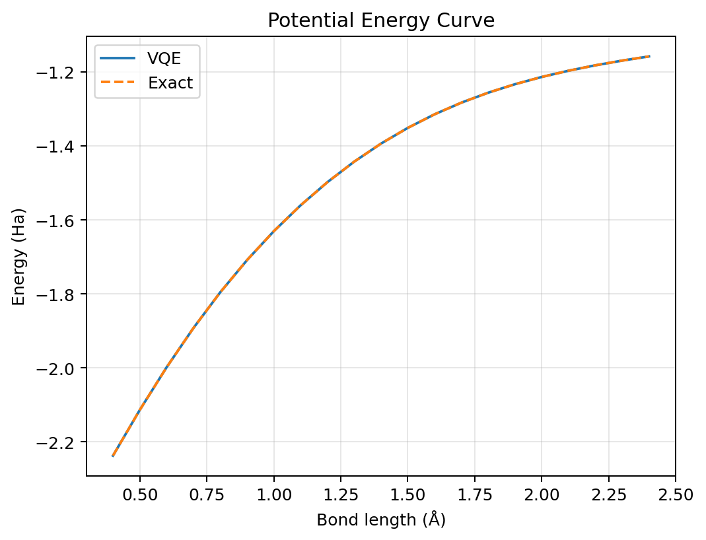
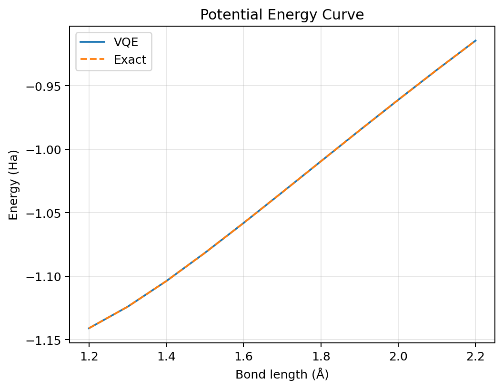
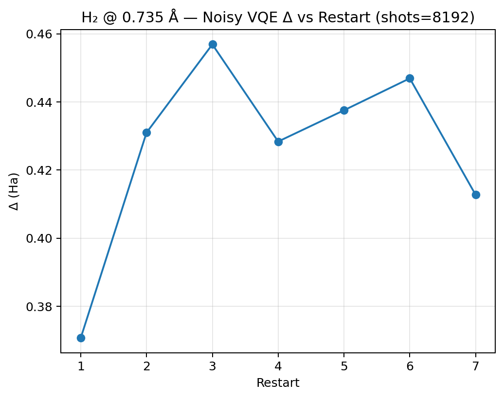

<<<<<<< HEAD
# Quantum-Chemistry-Small-Molecule-Energy-Estimator-H-LiH
=======
# Small Molecule Energy with VQE (H₂ & LiH)

> Hackathon Problem Statement: Implement a **Variational Quantum Eigensolver (VQE)** to estimate **ground-state energies** of small molecules.  
> This project applies VQE to **Hydrogen (H₂)** and **Lithium Hydride (LiH)** using **Qiskit Nature + PySCF**, comparing results against exact diagonalization and exploring noisy simulation behavior.

---

## 📖 Abstract
This project demonstrates how near-term quantum algorithms can estimate the **ground-state energy** of small molecules using the **Variational Quantum Eigensolver (VQE)**.  
We study **H₂** and **LiH** in STO-3G basis, validate against exact methods, and analyze the effect of noise and finite shots. The results highlight the promise of hybrid quantum-classical methods for quantum chemistry in the NISQ era.

---
---

## 🌐 Webpage Showcase

The project also includes a simple dark-mode dashboard to visualize results interactively.  
Below are example screenshots:

### Interactive H₂ Molecule
<p align="center">
  
</p>

### Results Dashboard
<p align="center">
  
</p>


## 🧪 Methodology

1. **Hamiltonian Construction**  
   - Molecular integrals generated via **PySCFDriver** (Qiskit Nature).  
   - Qubit Hamiltonian obtained with **Jordan–Wigner** and **Parity mappings**.  
   - Active space & freeze-core reductions applied for LiH.

2. **Ansatz**  
   - **Hartree–Fock** reference.  
   - **UCCSD (Unitary Coupled Cluster Singles & Doubles)** variational ansatz.  
   - Optimizers: SLSQP, COBYLA (ideal); SPSA (noisy).

3. **Simulations**  
   - **Ideal (statevector Estimator)** → reference accuracy.  
   - **Noisy (AerSimulator + BackendEstimator)** → finite shots (4k–16k), SPSA optimizer, multi-start restarts.

4. **Validation**  
   - Reference results via **NumPyMinimumEigensolver** (exact diagonalization).  
   - Error metric: Δ = E_VQE − E_exact (Ha).

---

## 📊 Results

### H₂ Potential Energy Curve
- PEC scanned over 0.4–2.4 Å.  
- **Equilibrium bond length ≈ 0.735 Å**.  
- Ideal VQE energies exactly match FCI reference (Δ ≈ 0).  

<p align="center">
  
</p>

---

### LiH Potential Energy Curve
- Freeze-core (Li 1s) + 2e2o active space used.  
- PEC scanned over 1.2–2.2 Å.  
- **Equilibrium bond length ≈ 1.6–1.7 Å**.  

<p align="center">
  
</p>

---

### H₂ Noisy Simulation (R = 0.735 Å, 8192 shots, SPSA, 7 restarts)
- Best noisy energy: **−1.521 Ha**  
- Exact energy: **−1.892 Ha**  
- Best Δ ≈ **0.37 Ha**  
- Noise + shot statistics cause error inflation, but optimization still converges near the physical minimum.

<p align="center">
  
</p>

---

## 🗂 Deliverables
- **PEC CSVs**:  
  - `results/csv/pec_h2_sto3g.csv`  
  - `results/csv/pec_lih_sto3g.csv`  
- **Plots**:  
  - `results/figs/pec_h2.png`  
  - `results/figs/pec_lih.png`  
  - `results/figs/h2_noisy_deltas.png`  
- **Source Code**: Python modules in `src/` (drivers, ansatz, VQE runners, plotting, sweep).  
- **Makefile targets**: `make h2`, `make lih`, `make noisy`.

---

## ⚙️ Setup & Run

```bash
# 1. Environment
python3 -m venv .venv && source .venv/bin/activate
pip install -r requirements.txt

# 2. Generate H₂ PEC
make h2

# 3. Generate LiH PEC
make lih

# 4. Noisy H₂ run (8192 shots, SPSA)
make noisy
